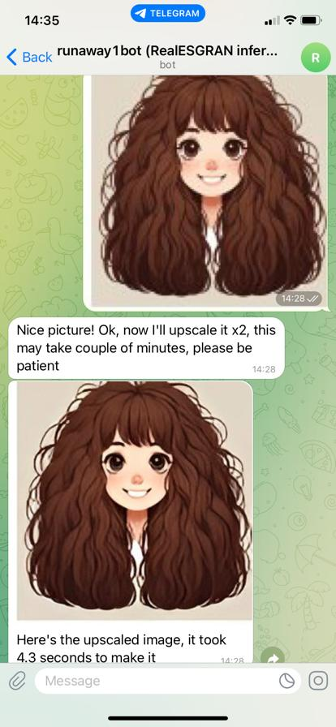

# What's This

This is a final course assignment for the [DLS School](https://dls.samcs.ru/) course on deep learning (part 1, computer vision).

The work here is a sample integration of the [Real-ESRGAN](https://github.com/xinntao/Real-ESRGAN) upscaler/restoration model as an aiogram-powered Telegram bot, hosted as a serverless Azure Function App.

Specifically it uses RealESGRAN_x2plus model variation.

## Prerequisites

1. Real-ESRGAN is integrated into the repo as a submodule. Once pulled, its `setup.py` needs to be called.

2. `TG_BOT_TOKEN` has to contain a valid Telegram bot token (obtained from @BotFather). It's a good idea to have separate bots and tokens for local testing and for the 'prod' deployed version.

3. This is a webhook version of the Telegram bot, and it installs a webhook for the bot in telegram at startup. For local runs, this assumes there has to be some sort of proxy to tunnel the public URI to the local machine. I was using [ngrok.com](https://ngrok.com/); it works great, provides static URIs (one for free) that can be set up once and for all. `WEBSITE_HOSTNAME` env variable must contain this public address. NB: the real Azure cloud runtime sets this variable automatically.

4. Azure Functions Core Tools need to be installed (`func --version` shall work) for local testing of Azure Functions enabled version.

To reiterate: `TG_BOT_TOKEN` and `WEBSITE_HOSTNAME` must be set before running.

## What's in the Repo

1. `inference.py` - This is an abridged version of the Real-ESRGAN inference call used by the bot. It can be run separately as `python inference.py` (will upscale `sample.jpeg` to `output.jpeg`).

2. `app.py` - Local version of the bot that is not bound with Azure functions, simply a python app. Can be run as: `python .\app.py`.

3. `function_app.py` - actual Azure Function integrated version of the bot. If Azure Functions Core Tool CLI toolset is installed it can be run locally as: `func start -p 80`.

4. `Dockerfile` - Dockerized version, build and run with `dockerbuild.ps1`, `dockerrun.ps1` respectively (just trivial docker commands there).

5. Publishing to Azure - There is nothing on that in the repo but that involves following steps:
   - Setup DockerHub account.
   - Build docker image and push it to Docker Hub.
   - Create a new Azure Function App on the Azure portal (or via CLI)
     - Set it up as having container deployment (requires upgraded Azure account); provide the tag that was used on the Docker Hub.
     - Make sure to add Application Insights when prompted.
     - Add `TG_BOT_TOKEN` configuration variable (`WEBSITE_HOSTNAME` and `APPLICATIONINSIGHTS_CONNECTION_STRING` is set by Azure automatically).

NB: Uploading an image with `/rotate` caption will return a rotated image, this functionality is for debugging purposes.

## Known Issues/Possible Next Steps

* This project was meant as an experiment to see if Azure Functions work well for CPU inference. So far, it's not working great and I was unable to invest more time into troubleshooting so far.
  - Performance is about 2.5-4 times slower than my local "Processor 11th Gen Intel(R) Core(TM) i5-1135G7 @ 2.40GHz, 2419 Mhz, 4 Core(s), 8 Logical Processor(s)" laptop. Also performance is not very stable.
  - Bot 'readiness' is very unstable: when not used, the bot seems to be getting into a state where it's unable to do inference sometimes, even though it responds to start or help commands. That's pretty weird. Looking at the logs, my theory is that once a host wakes up, it takes time before it's able to process inference requests, for a reason totally unclear.
  - With the cloud-hosted version, I was unable to complete the inference of an image with a resolution of more than 512x512 (or at least it's too likely to fail). Most likely it falls out of Azure function timeout, but I didn't check.

* (Almost) no error handling implemented.

* Mostly due to (unnecessary) torch dependencies, the docker image size is 10 Gb; should be optimized by using CPU-only torch.

* Azure's application insights integration assumes `APPLICATIONINSIGHTS_CONNECTION_STRING` env var is set. I didn't test the behaviour of local azure function tests without this being properly set, it might not work.

* Real-ESRGAN is a well-formed package so could be integrated more neatly (e.g., without manual call to `setup.py`; manual call to install its dependencies is also probably not needed).

* Logging setup needs some cleanup (e.g., some infos shall be debugs, and there are duplicating prints here and there); but Application Insights traces are functional with this setup.

* For some reason, the bot creation sample I was following used the tg token as the webhook endpoint. I did the same, but thinking about it, I started to believe that it doesn't have to be like that and is not a good idea actually.

